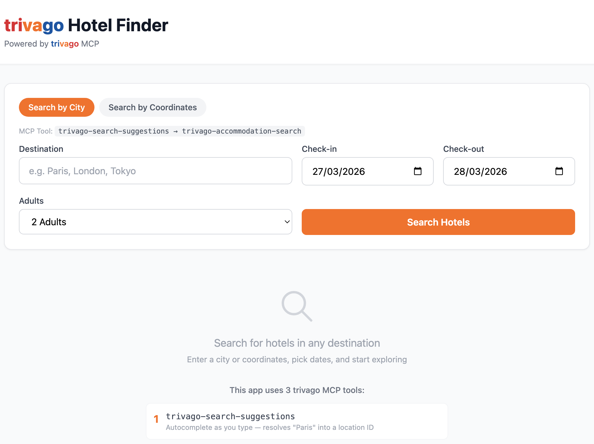

# trivago Hotel Finder

A clean, functional travel planning assistant that helps users find hotel deals using the [trivago MCP Server](https://mcp.trivago.com/docs). Built with React, Vite, Tailwind CSS, and a lightweight Node.js/Express backend proxy.

> Built as part of a Software Engineer application to trivago — Marketing Solutions team

## Screenshots

<!-- Add screenshots here -->
| Search Form | Hotel Results |
|-------------|---------------|
|  |  |

## How It Works

1. User enters a **destination city**, **check-in/check-out dates**, and **number of adults**
2. The backend calls `trivago-search-suggestions` to resolve the destination into a location ID
3. The backend calls `trivago-accommodation-search` with the resolved location and filters
4. The frontend displays hotel results as cards with name, rating, price, and "View Deal" links

## trivago MCP Tools Used

| Tool | Purpose |
|------|---------|
| `trivago-search-suggestions` | Resolves a text query (e.g. "Paris") into a structured location with an item ID |
| `trivago-accommodation-search` | Searches hotels by location ID, dates, and guest count |
| `trivago-accommodation-radius-search` | Searches hotels by latitude/longitude coordinates (available via `/api/radius-search`) |

All MCP communication uses the **Model Context Protocol (JSON-RPC 2.0)** over HTTP, targeting `https://mcp.trivago.com/mcp`.

## Tech Stack

- **Frontend:** React 18 + Vite + Tailwind CSS
- **Backend:** Node.js + Express (MCP proxy)
- **Protocol:** Model Context Protocol (MCP) over HTTP/SSE

## Getting Started

### Prerequisites

- Node.js 18+ and npm

### Installation & Running

```bash
# Clone the repository
git clone https://github.com/yourusername/trivago-mcp-demo.git
cd trivago-mcp-demo

# Install all dependencies (root + backend + frontend)
npm install

# Start both frontend and backend
npm run dev
```

This starts:
- Frontend at `http://localhost:5173`
- Backend proxy at `http://localhost:3001`

The frontend proxies `/api/*` requests to the backend during development.

## Project Structure

```
trivago-mcp-demo/
├── frontend/              React + Vite + Tailwind
│   └── src/
│       ├── App.jsx            Main app with search flow
│       ├── components/
│       │   ├── SearchForm.jsx     Search input form
│       │   ├── HotelCard.jsx      Individual hotel card
│       │   └── ResultsList.jsx    Grid of hotel cards
│       └── main.jsx
├── backend/               Node.js + Express proxy
│   └── server.js              MCP proxy server
├── README.md
└── package.json           Root config with concurrently
```

## API Endpoints (Backend)

| Method | Endpoint | Description |
|--------|----------|-------------|
| `GET` | `/api/suggestions?query=Paris` | Get destination suggestions |
| `POST` | `/api/search` | Search hotels (body: `{ query, checkIn, checkOut, adults }`) |
| `POST` | `/api/radius-search` | Search by coordinates (body: `{ latitude, longitude, checkIn, checkOut, adults }`) |
| `GET` | `/api/tools` | List available MCP tools |

## Author

**Umar Farook M**
- Email: umarfarookbtech@gmail.com
- LinkedIn: [linkedin.com/in/umarfarookm](https://linkedin.com/in/umarfarookm)

## License

MIT
