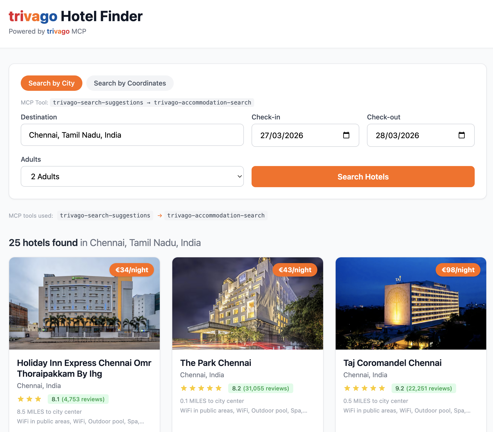

# trivago Hotel Finder

A clean, functional travel planning assistant that helps users find hotel deals using the [trivago MCP Server](https://mcp.trivago.com/docs). Built with React, Vite, Tailwind CSS, and a lightweight Node.js/Express backend proxy.

> Built as part of a Software Engineer application to trivago — Marketing Solutions team

**Live Demo:** [https://umars-trivago-mcp.vercel.app](https://umars-trivago-mcp.vercel.app)

## Screenshots

| Search Form | Hotel Results                      |
|-------------|------------------------------------|
|  |  |

## How It Works

The app exposes **three modes** via top-level tabs:

### 1. AI Chat *(default)*
Natural-language chat backed by **DeepSeek** (`deepseek-chat` via its OpenAI-compatible API) with the three trivago MCP tools wired in as function tools. The model:
- Parses free-form requests ("Plan 2 weeks in Tokyo and Osaka in January 2026", "hotels near the Etihad Stadium for 4 days")
- Picks the right MCP tool(s), fills in dates, guests, and coordinates
- Runs a multi-turn tool-call loop against `https://mcp.trivago.com/mcp`
- Replies with a short summary; the frontend renders the hotel cards inline, grouped by city/landmark for multi-leg itineraries

### 2. Search by City
Form-driven flow. Calls `trivago-search-suggestions` → `trivago-accommodation-search`.

### 3. Search by Coordinates
Form-driven flow. Calls `trivago-accommodation-radius-search` directly.

## trivago MCP Tools Used

| Tool | Purpose |
|------|---------|
| `trivago-search-suggestions` | Resolves a text query (e.g. "Paris") into a structured location with an item ID |
| `trivago-accommodation-search` | Searches hotels by location ID, dates, and guest count |
| `trivago-accommodation-radius-search` | Searches hotels by latitude/longitude coordinates |

All MCP communication uses the **Model Context Protocol (JSON-RPC 2.0)** over HTTP, targeting `https://mcp.trivago.com/mcp`.

## Tech Stack

- **Frontend:** React 18 + Vite + Tailwind CSS
- **Backend:** Node.js + Express (MCP proxy)
- **Protocol:** Model Context Protocol (MCP) over HTTP/SSE

## Getting Started

### Prerequisites

- Node.js 18+ and npm
- A **DeepSeek API key** for the AI Chat tab (the manual-search tabs work without one). Get one at https://platform.deepseek.com

### Installation & Running

```bash
# Clone the repository
git clone https://github.com/yourusername/trivago-mcp-demo.git
cd trivago-mcp-demo

# Install all dependencies (root + backend + frontend)
npm install

# Set your DeepSeek key for the AI Chat endpoint
export DEEPSEEK_API_KEY=sk-...

# Start both frontend and backend
npm run dev
```

This starts:
- Frontend at `http://localhost:5173`
- Backend proxy at `http://localhost:3001`

The frontend proxies `/api/*` requests to the backend during development.

### Deploying to Vercel

Add `DEEPSEEK_API_KEY` as an environment variable in your Vercel project settings. Without it, the **AI Chat** tab returns a 500; the other two tabs continue to work.

## Project Structure

```
trivago-mcp-demo/
├── frontend/              React + Vite + Tailwind
│   └── src/
│       ├── App.jsx            Tabs: AI Chat / City / Coordinates
│       ├── components/
│       │   ├── ChatInterface.jsx  Chat UI + inline hotel cards
│       │   ├── SearchForm.jsx     Form-driven search (city or radius)
│       │   ├── HotelCard.jsx      Individual hotel card
│       │   └── ResultsList.jsx    Grid of hotel cards
│       └── main.jsx
├── backend/               Node.js + Express proxy (local dev)
│   └── server.js              Mirrors the Vercel /api endpoints
├── api/                   Vercel serverless functions (production)
│   ├── chat.js                POST /api/chat — DeepSeek + trivago tools loop
│   ├── search.js              POST /api/search
│   ├── radius-search.js       POST /api/radius-search
│   ├── suggestions.js         GET  /api/suggestions
│   ├── tools.js               GET  /api/tools
│   └── _lib/
│       ├── mcp.js             MCP JSON-RPC client + session cache
│       └── chat.js            Tool schemas + tool-use loop
├── README.md
└── package.json           Root config (openai SDK, concurrently)
```

## API Endpoints (Backend)

| Method | Endpoint | Description |
|--------|----------|-------------|
| `POST` | `/api/chat` | AI chat with trivago tools (body: `{ messages: [{ role, content }, ...] }`). Requires `DEEPSEEK_API_KEY`. Returns `{ text, hotelsByLabel, toolsUsed }`. |
| `GET` | `/api/suggestions?query=Paris` | Get destination suggestions |
| `POST` | `/api/search` | Search hotels (body: `{ query, checkIn, checkOut, adults }`) |
| `POST` | `/api/radius-search` | Search by coordinates (body: `{ latitude, longitude, checkIn, checkOut, adults }`) |
| `GET` | `/api/tools` | List available MCP tools |

### Sample chat prompts

The AI Chat tab shows five sample prompts on first load. Specific dates in the prompts are computed relative to **today** (see `buildSamplePrompts` in `ChatInterface.jsx`) so they're always in the future, e.g.:

- "I'm looking for a hotel in Berlin from *{+2 months}* to *{+2 months +4 days}*."
- "Search an accommodation near the Eiffel Tower with 2 rooms for 2 adults and 2 children aged 6 and 10."
- "I need an accommodation in Dusseldorf with pool and high guest rating, from *{+4 months}* to *{+4 months +8 days}*."
- "I'm planning my vacation to Japan in *{+6 months}*. I'd like to stay in Tokyo and Osaka for 2 weeks — find suitable accommodations."
- "Find a hotel near the Etihad Stadium, from *{+3 months}* for 4 days."

## Author

**Umar Farook M**
- Email: umarfarookbtech@gmail.com
- LinkedIn: [linkedin.com/in/umarfarookm](https://linkedin.com/in/umarfarookm)

## License

MIT
